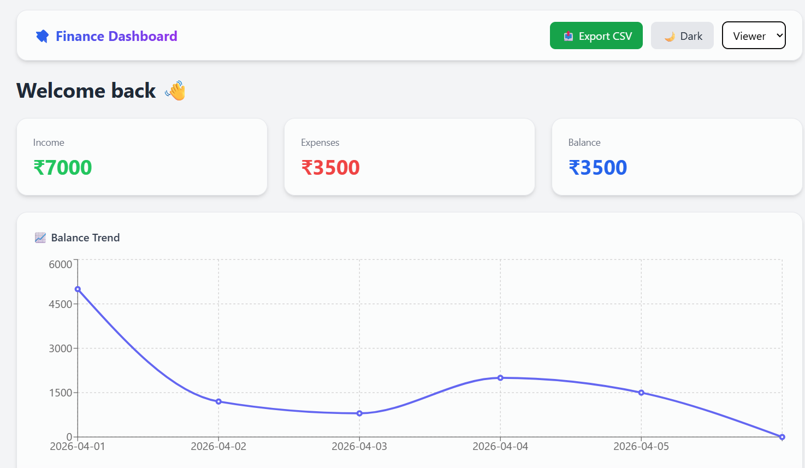
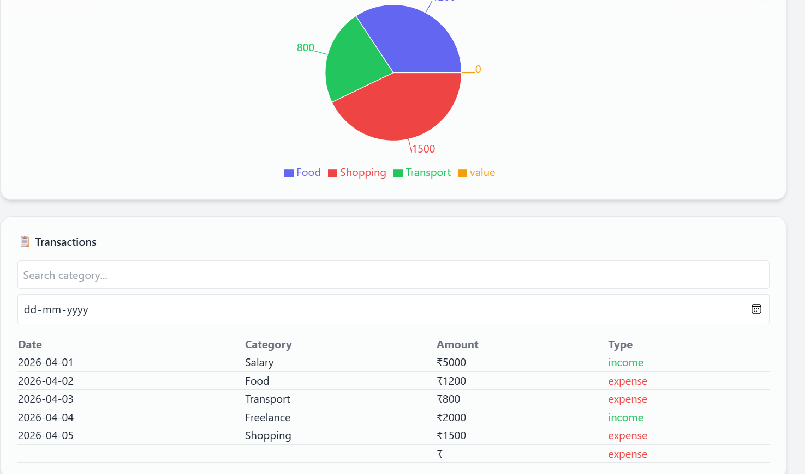

# 💸 Finance Dashboard

## 📌 Overview

This project is a modern, responsive **Finance Dashboard** built to help users track and understand their financial activity.

It provides a clean interface to:

* Monitor income, expenses, and balance
* Explore transaction data
* Visualize spending patterns
* Gain useful financial insights

The application is fully frontend-based and uses mock data with state management to simulate real-world behavior.

---

## 🚀 Features

### 📊 Dashboard Overview

* Summary cards for:

  * Total Income
  * Total Expenses
  * Balance
* Interactive charts:

  * 📈 Line chart (balance trend over time)
  * 🥧 Pie chart (spending breakdown by category)

---

### 📋 Transactions Section

* Displays transaction details:

  * Date
  * Amount
  * Category
  * Type (income/expense)
* Features:

  * 🔍 Search by category
  * 📅 Filter by date
  * Empty state handling

---

### 👤 Role-Based UI

* Simulated role switching:

  * **Viewer** → Read-only access
  * **Admin** → Can add transactions
* Controlled via dropdown in navbar

---

### ➕ Add Transaction (Admin Only)

* Add new income/expense entries
* Updates UI instantly
* Demonstrates interactive state handling

---

### 💡 Insights Section

* Displays useful financial observations:

  * Highest transaction
  * Spending highlights

---

### 🌙 Dark Mode

* Toggle between light and dark themes
* Smooth UI transition
* User preference saved using localStorage

---

### 📤 Export Feature

* Export all transactions as a CSV file
* Useful for reporting and analysis

---

### 💾 Data Persistence

* Transactions stored in **localStorage**
* Data remains even after refresh

---

### ✨ UI & UX Highlights

* Modern glassmorphism design
* Responsive layout (mobile + desktop)
* Smooth animations and transitions
* Clean spacing and visual hierarchy

---

## 🛠️ Tech Stack

* **Frontend Framework:** React (Vite)
* **Styling:** Tailwind CSS
* **Charts:** Recharts
* **State Management:** Context API
* **Data Storage:** LocalStorage

---

## ⚙️ Setup Instructions

### 1️⃣ Clone the repository

```bash
git clone <your-repo-link>
cd finance-dashboard
```

### 2️⃣ Install dependencies

```bash
npm install
```

### 3️⃣ Run the project

```bash
npm run dev
```

### 4️⃣ Open in browser

```
http://localhost:5173
```

---

## 🧠 Approach

The project is built using a **component-based architecture** to ensure modularity and scalability.

* **Context API** is used for global state management (transactions, filters, role, theme)
* **Reusable components** (cards, charts, table) improve maintainability
* **Tailwind CSS utility classes** ensure fast and consistent UI development
* **LocalStorage** simulates backend persistence
* Focus was placed on:

  * Clean UI design
  * Smooth user experience
  * Logical data flow

---

## 🎯 Key Highlights

* Combines **UI design + functionality**
* Demonstrates **real-world frontend patterns**
* Includes **data visualization + interaction**
* Shows **attention to UX details**

---

## 📸 Screenshots

### 🏠 Dashboard


### 🌙 Dark Mode


### ➕ Add Transaction


### 📊 Charts


---

## 📌 Conclusion

This project showcases my ability to design and build a **modern, interactive dashboard interface** with clean UI, structured components, and effective state management.

---

## 🙌 Author

**Pooja Nayak**
